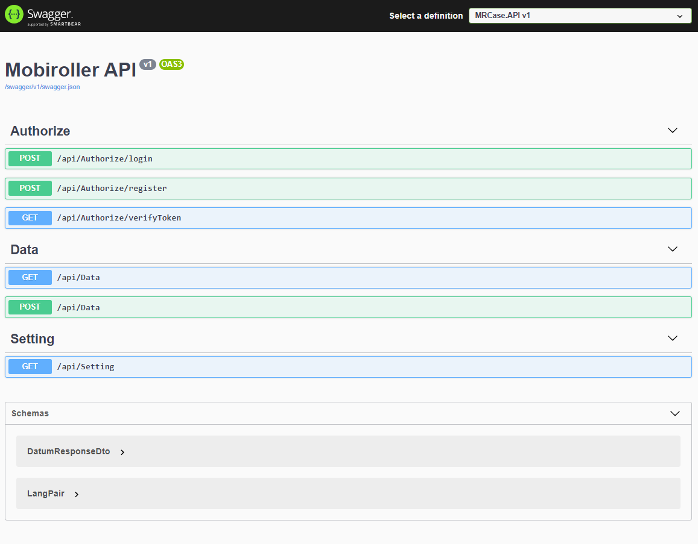

    

# Mobiroller Case
This Project features users to import their specific json data(important events) and view them after logging in to application.  
  
<b>UI: </b> https://mrcase.alims.online/  
<b>API: </b> https://mrcaseapi.alims.online/swagger

<b>Demo User</b>  
<b>Username</b>: demoUser  
<b>Password</b>: Password1.

### Supported Languages
- Turkish
- Italian

### Used Technologies
<b>Backend:</b> ASP.NET Core 3.1, EF Core, MsSQL 
<b>Frontend:</b> HTML, CSS, Javascript, JQuery, Bootstrap 4

### What is in this project?
Authentication, Localization, Exception Handler, In-Memory Cache, AutoMapper, Multi-Tenancy, Validation with ActionFilter, Pagination
***

### How To Use?
After Clone/Download project, execute command `EntityFrameworkCore\Update-Database` in Package Manager Console 

 

<b>Register/Login</b>

  

 

<b>Import Data by your Language. Other languages will not be imported. After import you can change pages to see all data.</b>

   

 

<b>That's all. OpenApi Documentation</b>

  

